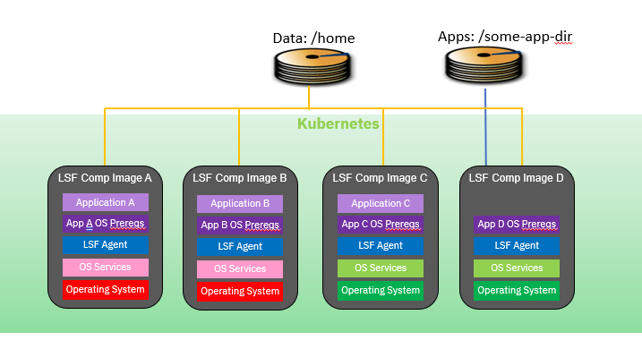

# Creating Custom LSF Compute Images
The jobs that LSF will run may need different combination of Operating Systems (OS) and libraries.  The LSF cluster can have multiple types of compute pods with different OS's and packages installed on them.  The diagram below illustrates some of the types of LSF compute images that could be generated.

[Return to previous page](README.md)
