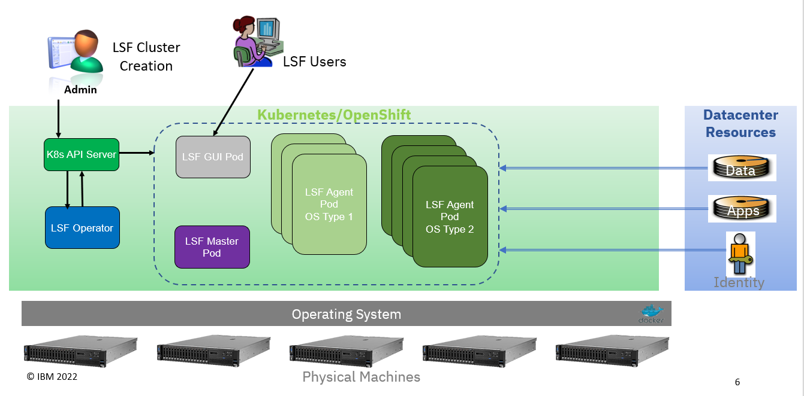

# LSF On Kubernetes/OpenShift

*NOTE: This code is provided without support.*

## Introduction
Welcome to the LSF on Kubernetes repository.  IBM® Spectrum LSF (formerly IBM® Platform™ LSF®) is a complete workload management solution for demanding HPC environments. Featuring intelligent, policy-driven scheduling and easy to use interfaces for job and workflow management, it helps organizations to improve competitiveness by accelerating research and design while controlling costs through superior resource utilization.

## Repository Contents
This repository contains code for packaging LSF as images for running on Kubernetes / OpenShift.  It also contains the code for an Operator for automating the deployment of LSF.  This code can be used in conjunction with LSF Suite to deploy LSF clusters on Kubernetes or OpenShift.

## What Type of LSF Cluster Will this Deploy
The diagram below illustrates the LSF use case supported by the code in this repository.

The LSF cluster will get its resources from Kubernetes.  The LSF cluster will run entirely inside of Kubernetes.  External datacenter resources for storage and user authentication may also be accessed.  This provides a way for the LSF compute pods to access any application and user data to process.

The operator will deploy a functioning LSF cluster on Kubernetes.  Its function is to create the other pods in the cluster as well as other Kubernetes obkects that the LSF cluster needs.
The LSF Master pod runs the Scheduler processes for dispatching the batch jobs.  Configuration is stored on a Persistant Volume (not shown in this diagram).
The LSF agent pods are the compute pods. The jobs will run inside the LSF Agent pods.  The LSF agent pods will provide the OS prerequisites, and LSF binaries.  The application can be built into the LSF Agent pods or mounted from an external NFS server.
The LSF GUI pod runs the LSF Application Center.  Users can login to the web GUI running on this pod and submit jobs.  They may also use the REST interface provided by this pod with the desktop client to run jobs.

User authentication services can be enabled in the LSF pods.  This allows regular users to login and run jobs.  Home directories, datasets, and application binaries can be mounted in the pods.

It is possible to build multiple LSF Compute pod types.  This is necessary to support jobs that have specific OS and library versions.  Instructions are provided.

## Other LSF Kubernetes Integrations
LSF has other native integrations with Kubernetes.  These support different use cases:
* **LSF Connector for Kubernetes** - This integration supports LSF as the scheduler for Kubernetes.  The purpose of this integration is to allow a single cluster of machines to run both LSF jobs, and Kubernetes pods.  LSF manages the resources, and makes the scheduling decisions for Kubernetes.  For additional information see the [LSF Connector for Kubernetes](https://www.ibm.com/docs/en/spectrum-lsf/10.1.0?topic=lsf-connector-kubernetes)

* **LSF Resource Connector** - This integration allows LSF to dynamically borrow resources from a seperate Kubernetes cluster.  When triggered by job demand LSF will start additional pods on a Kubernetes cluster.  These pods will run LSF compute binaries and will join the existing LSF cluster, and when ready will run jobs.  When the job pressure drops the LSF pods will be automatically shutdown.  For more information see the [LSF Resource Connector](https://www.ibm.com/docs/en/spectrum-lsf/10.1.0?topic=lsf-resource-connnector)

## Prerequisites
The following are needed to create the LSF images and deploy an LSF cluster:
* Cluster Administrator access
* A persistent volume for LSF state storage.
* The LSF Suite bin file
* Podman
* Jq

A Kubernetes secret is also required to provide the database password.

### Recommended Additions
The following are also recommended:
* Persistent Volume for users home directories
* Persistent Volumes for application binaries
* LDAP/NIS/YP authentication server that the LSF pods can use for user authentication

## Resource Requirements
The resources that are given to the pods will govern the number and size of pods that can be run on the cluster.  The compute pods should b
e as large as possible.  The minimal requirements for an LSF on Kubernetes cluster are:
* Operator Pod:
  - 512 MB of RAM
  - 200m of CPU
* LSF Master Pod:
  - 1 GB of RAM
  - 1 CPU core
* LSF GUI Pod:
  - 16 GB or RAM
  - 2 CPU cores
* LSF Compute Pod:
  - 1 GB of RAM
  - 2 CPU cores

Production versions would use many more compute pods with even larger CPU and memory allocations.  For example:
* 32 GB of RAM
* 16 CPU cores

### Limitations
No encryption of the data at rest or in motion is provided by this deployment.  It is up to the administrator to con
figure storage encryption and IPSEC to secure the data.

**NOTE:  The CPU resources should use the same values for the resource.request.cpu and resource.limit.cpu.  Likewise
 for resource.request.memory and resource.limit.memory.  This is so the pods have a guaranteed QOS.**

The LSF processes must run as root in order to start jobs with the users UID/GID.

## Preparing to Run LSF on Kubernetes
Running LSF on Kubernetes will take some time to get the LSF agents correctly configured for your workloads.  Iterate through the following steps to create a LSF cluster that suites your needs:

1. [Build the Initial Images](README-Building-the-images.md)
2. [Deploy the LSF Operator](README-lsf-operator.md)
3. [Deploying the LSF Cluster](README-deploying-lsf-cluster.md)
4. [Setting up Storage](README-setting-up-storage.md)
5. [Setting up User Authentication](README-setting-up-user-authentication.md)
6. [Customizing Images for Running Jobs](README-custom-images.md)

*NOTE: This code is provided without support.*
